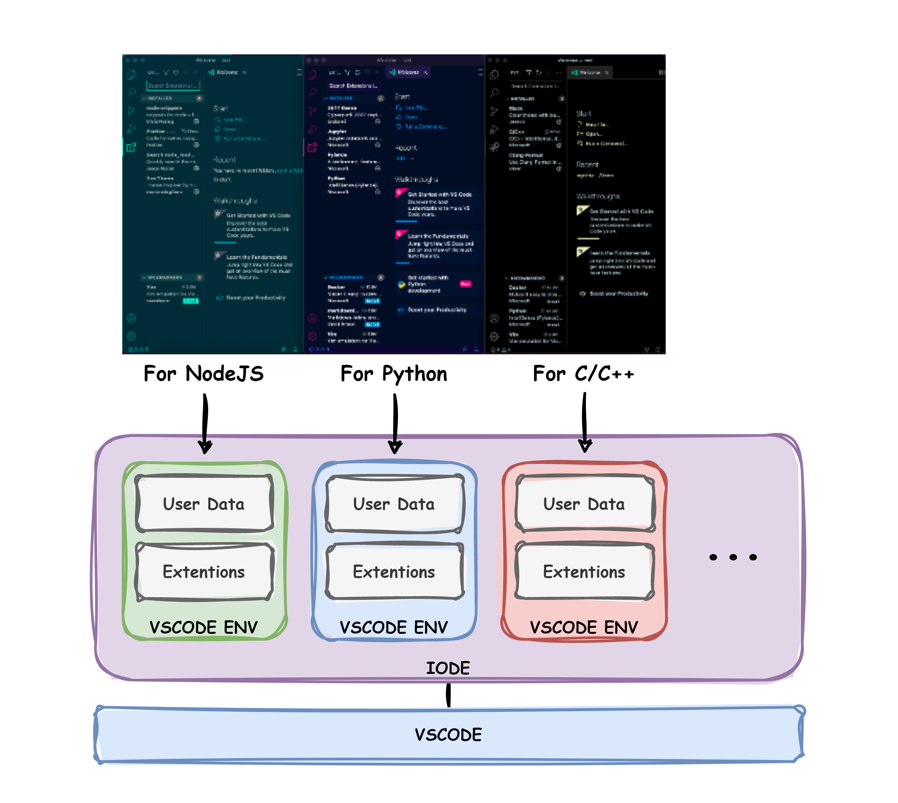

# IODE - Management of isolated VSCODE environments

IODE is a command-line tool that makes it easy to maintain and manage isolated vscode environments written in Python.



---

## Installation
- Option 1 : Install from pypi
    ```
    pip install iode --user
    ```
- Option 2 : Install from soruce
    ```
    git clone https://github.com/jugangdae/iode
    cd iode
    pyhton -m build
    pip install iode-0.0.1-py3-none-any.whl
    ```
---
## Commands

1. `create` : Create a new IODE environment.
    ```
    iode create [iode_env]
    iode c [iode_env]
    ```
2. `list` : Show iode env list
    ```
    iode list
    iode l
    ```
3. `run` : Executes VSCODE using an IODE environment
    ```
    iode run [iode_env] [work_path]
    iode r [iode_env] [work_path]
    ```
4. `Delete` : Delete an IODE environment.
    ```
    iode delete [iode_env]
    iode d [iode_env]
    ```
5. `help` and `version`
    ```
    iode -h, --help
    iode -v, --version
    ```
---
## Config (~/.iodeconfig)
```
[setting]
iode_run = [code or code-insider]
iode_dir = [path of iode environments directory]
```
